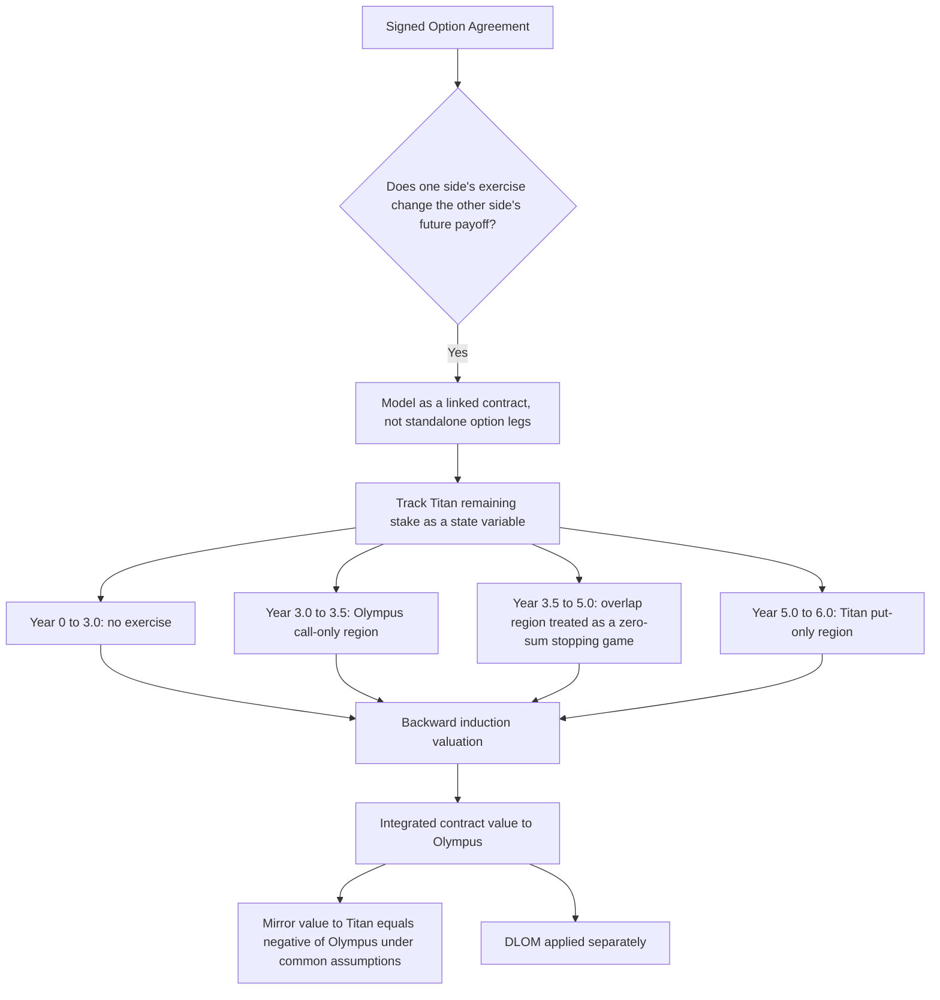

# Project Horizon - Option Methodology
**Prepared for:** [MD Name]
**Valuation date:** December 31, 2025
**Model basis:** Project Horizon option valuation notebook and supporting memorandum
**Subject:** Methodology note for valuation of the linked call / put Option Agreement over the residual 25% CCBA stake

---

## Executive Overview

This note explains what was modeled, why that modeling architecture was chosen, and how the current valuation framework differs from a standalone option valuation.

The central methodological point is that the signed instrument is not well represented as an ordinary call option valued on its own, or as a standalone call minus a standalone put valued independently. The contract is a linked agreement in which:

- Olympus BV holds a delayed-start call right;
- Titan holds a delayed-start put right;
- Olympus BV may reduce Titan's future putable block through prior call exercise;
- the overlap period creates strategic interaction because both sides may prefer to move first; and
- the relevant payoff depends on the remaining stake at the time of exercise, not on a permanently fixed 25% block.

For that reason, the methodology presented here treats the contract directly as a state-dependent, strategically linked agreement.

For a client or auditor audience, the methodology should therefore be explained in layers:

- first, the business narrative and why a plain option framework is insufficient;
- second, simple abstract examples showing how the contract actually behaves;
- third, the model architecture and key assumptions;
- fourth, a compact technical specification for readers who need the implementation detail.

---

## 1. Purpose of This Note

This methodology note is intended to sit alongside the valuation memo and the working notebooks.

Its purpose is to explain:

- what the valuation problem is;
- why the contract had to be modeled as a linked instrument rather than as independent option legs;
- how the model chooses the amount of partial call exercise; and
- where management judgment or numerical approximation still enters the process.

This note is deliberately structured so that a non-technical reader can understand the commercial logic first, while an auditor or specialist reviewer can still find a concise technical specification later in the document.

---

## 2. Why a Standalone Option Valuation Is Not Sufficient

### 2.1 Core reason

If the contract were a plain standalone call, Olympus BV would simply decide whether and when to buy a fixed 25% block.

If the contract were a plain standalone put, Titan would simply decide whether and when to sell a fixed 25% block.

That is not the economics of the signed Project Horizon agreement.

The agreement is linked because one side's action changes the other side's future payoff set.

### 2.2 Abstract example 1: prior call exercise changes later put exposure

Suppose Olympus BV calls 10% of the company before Titan's put is exercised.

Under a standalone full-block put logic, Titan would still appear to own a put on 25%.

Under the actual contract logic, Titan now only holds 15% and can only put that remaining block.

That means a standalone put valuation overstates Titan's later putable exposure once prior call exercise is possible.

### 2.3 Abstract example 2: partial call amount matters

Suppose Olympus BV is better off exercising some call, but not necessarily all of it.

The relevant question is not only:

- exercise now, yes or no?

It is also:

- if Olympus acts now, how much should it call?

Calling 5% leaves a much larger residual block than calling 15%.

That changes:

- how much put exposure remains with Titan;
- how much timing optionality Olympus keeps on the residual block; and
- what Titan can still do in the overlap period.

So the amount of partial call exercise is part of the valuation problem, not just an implementation footnote.

### 2.4 Abstract example 3: overlap creates strategic interaction

From Year 3.5 to Year 5.0 both the call and the put can be live.

That does not mean both sides legally complete at the same time.

It means there can be decision points at which:

- Olympus prefers calling now rather than waiting; and
- Titan also prefers putting now rather than waiting.

That is a strategic collision over who gets there first.

The contract addresses that commercially through the notice-priority rule. Numerically, the valuation needs a method of representing that interaction.

### 2.5 Bottom line

The Project Horizon agreement should therefore be understood as a linked contract with state dependence and strategic interaction, not as a plain vanilla option package.

---

## 3. Methodology Architecture

### 3.1 Methodological framing

The contract is framed as a discrete-time stopping game from Olympus BV's perspective.

In plain English:

- before the call window opens, no one can act;
- in the early call window, only Olympus can act;
- in the overlap window, both sides can try to act strategically;
- after the call expires, only Titan can act;
- value is determined by backward induction across those regions.

### 3.2 Visual summary

---

## 4. What We Did and Why We Did It

### 4.1 Legal and commercial characterization

The signed agreement was first reviewed as a legal instrument rather than treated as a generic option template.

That review established the key mechanics that the model had to respect:

- delayed-start call window;
- delayed-start put window;
- overlap period;
- partial and multiple call exercise subject to contract constraints;
- Titan's put applying only to shares still held at the relevant time; and
- purchase price determined by SPA price plus Applicable Coupon through option completion.

This step matters because valuation architecture should follow contract mechanics, not the other way around.

### 4.2 Contract-linked state variable

The central state variable is Titan's remaining ownership under the option agreement.

Why this was done:

- because the future put exposure depends on what Olympus has already called;
- because the contract does not behave as though Titan permanently holds a fixed 25% until final resolution; and
- because the amount of residual ownership changes the feasible action set for both parties.

### 4.3 Partial call exercise as an endogenous decision

The model allows Olympus to choose the amount of call exercise from the contract-feasible menu rather than forcing a fixed tranche size.

Why this was done:

- because the amount called changes the residual put exposure;
- because the amount called changes the continuation value of the remaining contract; and
- because a rational holder should choose the amount that maximizes value, not merely decide whether to act.

### 4.4 Overlap region treated as a strategic game

The overlap region is modeled as a zero-sum stopping game from Olympus BV's perspective.

Why this was done:

- because both sides have live rights in the overlap period;
- because each side's preferred action depends on what the other side may do; and
- because the relevant question becomes not just valuation under uncertainty, but valuation under uncertainty plus strategic interaction.

### 4.5 DLOM kept separate from the core game

DLOM is applied separately after the clean contract value is obtained.

Why this was done:

- because marketability is a separate valuation adjustment, not the source of the contract's strategic exercise logic; and
- because separating the core contract engine from DLOM makes the methodology easier to explain, test, and audit.

---

## 5. How This Differs from a Standalone Option Valuation

| Topic | Standalone option framing | Project Horizon methodology |
|---|---|---|
| Basic unit of value | One option leg valued independently | Entire linked contract valued directly |
| Underlying stake | Fixed block throughout | Remaining Titan stake changes over time |
| Partial exercise | Often ignored or simplified away | Explicitly affects residual state and future put exposure |
| Put exposure | Often treated as unchanged full block | Limited to Titan's actual remaining shares |
| Overlap period | Usually not strategic | Strategic two-party region |
| Exercise logic | Single-holder optimal stopping | Two-party stopping game in the overlap window |
| Output | Often call less put as separate legs | Integrated contract value from Olympus perspective |

The main conceptual difference is therefore not cosmetic. It changes what is being valued.

---

## 6. Technical Analysis

### Technical analysis: contract representation

The contract is represented as a state-dependent instrument in which value depends on:

- current time;
- current equity value per share;
- Titan's remaining stake under the contract; and
- the admissible action sets of Olympus and Titan.

### Technical analysis: exercise windows

The notebook splits the timeline into four regions:

1. Year 0 to 3.0: no exercise region.
2. Year 3.0 to 3.5: Olympus call-only region.
3. Year 3.5 to 5.0: overlap region with strategic interaction.
4. Year 5.0 to 6.0: Titan put-only region.

This decomposition is useful because it explains why the instrument is not a single ordinary American-style problem from start to finish.

### Technical analysis: state grid

The model uses a remaining-state grid from 25% down to 7%, plus 0%.

This is still an approximation, but it captures a broad range of admissible partial-call outcomes while keeping the problem tractable.

### Technical analysis: stock process and valuation engine

The model uses:

- a risk-neutral recombining stock tree;
- monthly time steps;
- backward induction; and
- a max/min operator in the overlap region.

This gives a tractable discrete-time approximation to the stopping game.

### Technical analysis: Olympus decision rule

At each relevant node Olympus compares:

- waiting; and
- every contract-feasible call amount on the remaining-state grid.

Olympus chooses the action that maximizes Olympus value after accounting for what Titan can then do.

### Technical analysis: Titan decision rule

When Titan's put is live, Titan compares:

- waiting; and
- putting all remaining shares in the current state.

Titan is modeled as choosing the action that minimizes Olympus's value, which is equivalent to maximizing Titan's own value under a zero-sum framing.

### Technical analysis: same-bucket tie handling

The monthly grid does not observe exact intra-month notice timing.

Accordingly, the notebook uses a same-bucket priority parameter to approximate which side effectively gets there first when both sides prefer immediate action in the same modeled month.

This is best understood as a numerical representation of unresolved intra-month timing, not as an assertion that both notices legally complete simultaneously.

### Technical analysis: value to Titan

Under common assumptions, the contract is zero-sum between the two counterparties.

Accordingly:

- value to Olympus = integrated contract value from Olympus perspective;
- value to Titan = negative of Olympus value.

That equality would only fail if different party-specific assumptions were imposed, such as different funding, tax, credit, or liquidity adjustments.

---

## 7. Key Judgments and Limitations

The methodology is designed to be contract-faithful, but it still contains explicit judgments and approximations.

The most important ones are:

- **Zero completion lag in the primary valuation.** This is a simplifying assumption for valuation purposes, not a statement about whether the original transaction remained incomplete.
- **Discrete monthly exercise grid.** The model does not observe exact intra-month notice timing.
- **Discrete remaining-state grid.** The model approximates feasible exercise amounts rather than solving a continuous share-count control problem.
- **Same-bucket priority parameter.** This is a tractable approximation to intra-month pre-emption.
- **Risk-neutral equity dynamics.** The model uses stylized market dynamics rather than a bespoke fundamental forecast engine.
- **Regulatory lapse risk remains qualitative.** It is discussed but not deducted in the primary fair value.
- **Leakage, dividends, and SPA claims remain outside the primary clean value unless explicitly added.**
- **One source-control item remains open.** The SPA-derived USD 3.2bn reference equity value still needs the exact SPA paragraph citation before external circulation.

These limitations should be presented clearly to clients and auditors because they are part of good valuation governance, not signs that the model is unusable.

---

## 8. How to Present This to a Client or Auditor

The recommended communication order is:

1. Start with the contract story, not the code.
2. Explain why a standalone option approach is insufficient.
3. Show one or two abstract examples of how prior call exercise changes later put exposure.
4. Explain the time structure of the contract.
5. Explain why the overlap period creates strategic interaction.
6. Only then introduce the technical machinery: state grid, stock tree, backward induction, and tie handling.
7. Keep the most technical implementation detail in a short technical-analysis section rather than the opening narrative.

This ordering is usually the most effective way to make the methodology understandable to non-specialists while still giving auditors enough specificity.

---

## 9. Recommended Future Visuals

The Mermaid flowchart above is useful for a methodology note because it communicates the structure of the problem quickly.

For a later graphics pass, the following additional visuals would be worthwhile:

1. **Exercise-window timeline or Gantt chart.** This would show the no-exercise region, the call-only region, the overlap region, and the put-only region on one page.
2. **State-ladder visual.** This would show how 25% can move to lower remaining states through partial call exercise and why later put exposure shrinks with prior call exercise.
3. **Exercise-to-residual-state bridge.** This would show how each feasible Olympus call choice changes the residual block and therefore changes Titan's later put exposure.
4. **Overlap-region decision schematic.** This would show, at a high level, how Olympus and Titan each compare acting now versus waiting in the overlap region.

If a more polished client pack is needed later, those visuals would likely be better rendered as purpose-designed PNG or SVG exhibits rather than left purely as notebook or Markdown artifacts.

---

## 10. Closing Summary

The Project Horizon methodology is best explained as a contract-faithful linked valuation of one state-dependent agreement.

The key methodological features are that it:

- treats the contract as one linked instrument;
- endogenizes the amount of partial call exercise on a finer grid;
- recognizes Titan's put applies only to the residual block; and
- treats the overlap region as a strategic two-party problem rather than as a passive one-sided option.

That is the core methodological message a client or auditor needs to understand.